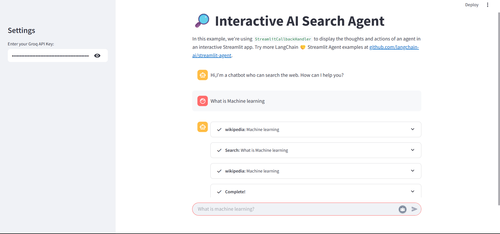

# 🔎 Interactive AI Search Agent

An interactive Streamlit app powered by **LangChain Agents** and **Groq's LLaMA 3** that enables real-time intelligent search using Wikipedia, ArXiv, DuckDuckGo, and a custom LangSmith RAG tool.

> 🚀 Built with **LangChain**, **Streamlit**, **Groq**, **FAISS**, **HuggingFace Embeddings**, and **LangChain Tools**.

---

## 📌 Project Features

### 🔍 Multi-source Search:
- **Wikipedia** – Query summaries from Wikipedia
- **ArXiv** – Access scientific paper abstracts
- **DuckDuckGo** – Perform general-purpose web searches
- **LangSmith RAG Search** – Search LangSmith docs via vector embeddings and FAISS

### 🧠 LLM-Powered Agent:
- Uses **Groq's ultra-fast LLaMA3-8b-8192** for reasoning and tool selection

### 💬 Conversational UI:
- Built with **Streamlit chat interface**
- Step-by-step reasoning using `StreamlitCallbackHandler`

### 🧰 Tool Integration:
- Combined multiple tools using `initialize_agent` (app.py) and `AgentExecutor` (notebook)

---

## 📁 Project Structure

```bash
Interactive-AI-Search-Agent/
│
├── app.py 
├── tools_agent.ipynb 
├── requirements.txt 
├── .env 
├── README.md 
└── assets
```

---

## 🔧 Setup Instructions

### 1. Clone the Repo

```bash
git clone https://github.com/Electrolight123/interactive-ai-search-agent.git
cd interactive-ai-search-agent
```

### 2. Install Requirements

```bash
pip install -r requirements.txt
```

### 3. Add `.env` File

Create a `.env` file in the root directory with the following:
```bash
GROQ_API_KEY=your_groq_api_key
HF_TOKEN=your_huggingface_token
```

## ▶️ How to Run the App

```bash
streamlit run app.py
```
🔐 Enter your Groq API key in the Streamlit sidebar to start chatting with the AI agent.

---

## 🔬 Tools & Components Used

### 📚 Search Tools

- **WikipediaAPIWrapper** – Search summaries from Wikipedia
- **ArxivAPIWrapper** – Get abstracts from scientific papers
- **DuckDuckGoSearchRun** – Perform web search queries
- **Retriever Tool (LangSmith)** – Custom RAG tool using:
    - WebBaseLoader for ingesting LangSmith documentation
    - RecursiveCharacterTextSplitter for chunking
    - FAISS vector store
    - HuggingFaceEmbeddings (`all-MiniLM-L6-v2`)

### 🤖 Agents

- `ZERO_SHOT_REACT_DESCRIPTION` Agent – Used in `app.py`
- OpenAI-style Tools Agent – Created using `create_openai_tools_agent` in `tools_agent.ipynb`

### 🧠 Model

-Groq ChatGroq (`Llama3-8b-8192`)
    - Fast and efficient inference for real-time AI response
    - Streaming output enabled via `StreamlitCallbackHandler`

---

## 📸 Screenshots

> Chat Interface (Streamlit)



## 🧪 Sample Queries

```bash
- What is machine learning?
- Tell me about LangSmith.
- What's the paper 1706.03762 about?
```

## 📄 License
This project is licensed under the **MIT License**. You're free to fork, modify, and build upon it.

## 🤝 Contributing
PRs and suggestions are welcome! If you find bugs or have enhancement ideas, feel free to open an issue.
